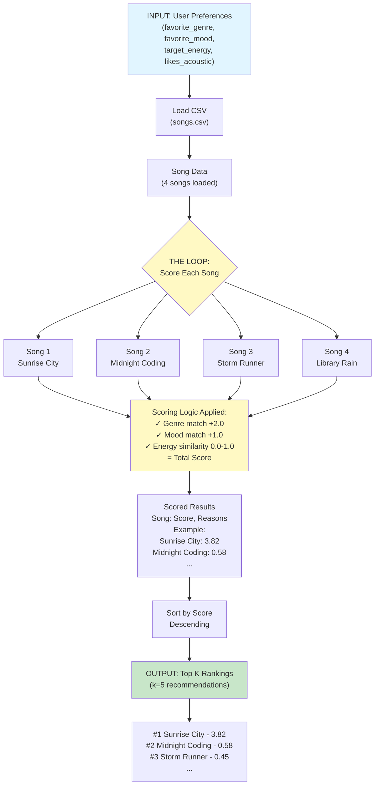

# Music Recommender Data Flow

## Pipeline: Input → Process → Output

## 3-Stage Pipeline

| Stage | What Happens | Data |
|-------|--------------|------|
| **INPUT** | Capture user's taste preferences | Genre, mood, energy target, acoustic preference |
| **PROCESS** | Loop through every song in CSV, score each one against user prefs | Each song gets scored: genre match (+2), mood match (+1), energy similarity (0-1) |
| **OUTPUT** | Sort by score, return top K results | Ranked list with explanations why each song matched |

## Key Logic in `score_song()`
- Compares each song's attributes against user preferences
- Accumulates points for matches
- Returns (score, reasons) tuple
- Then `recommend_songs()` sorts all scores and returns top K
